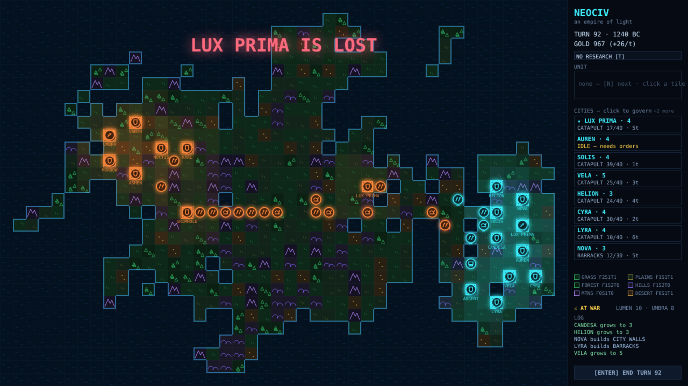

# NEOCIV

Tenth game in the harsh-critic-loop series, after
[NEONOID](https://github.com/melvincarvalho/neonoid),
[NEON MINER](https://github.com/melvincarvalho/neonminer),
[NEODROID](https://github.com/melvincarvalho/neodroid),
[NEON DASH](https://github.com/melvincarvalho/neondash),
[NEONLINGS](https://github.com/melvincarvalho/neonlings),
[NEOPOLIS](https://github.com/melvincarvalho/neopolis),
[NEON SCORCH](https://github.com/melvincarvalho/neonscorch),
[NEON MASTER](https://github.com/melvincarvalho/neonmaster) and
[NEON ELITE](https://github.com/melvincarvalho/neonelite). A
Civilization tribute: one settler, one rival, one seeded continent that
must be won. Food boxes and shield queues, a ten-tech ladder from bronze
to navigation, city walls that triple the defense, veterans from
barracks, the 1991 open-field stack kill, military upkeep that disbands
what the treasury cannot pay, and two roads to victory — conquest, or
the Great Beacon. Original worlds and names — Sid Meier's Civilization
(MicroProse, 1991) is copyrighted, and revered here.

**Play it: <https://melvincarvalho.github.io/neociv/>**



**There are no assets.** Every pixel and every sound is generated from
code. Two files: `index.html`, `game.js`. Arrows and Q/E/Z/C move the
selected unit, F founds a city, B governs one, T opens the tech ladder,
numbers queue production, R rush-buys, ENTER ends the turn. LUMEN is
you; UMBRA does not wait.

```bash
python3 -m http.server 8000   # or just open index.html
```

## The experiment

Same pipeline as the first nine games — one owner builds, deterministic
`?shot=` captures, four harsh sub-agent critics (three visual lenses
plus a Civilization-fidelity judge), honest scores — and the harness's
next species of proof: **empires as theorems.** Not a level, a god, a
duel, a descent, or a voyage — a whole civilization, replayed and
verified headlessly every build.

`tools/playtest.sh` proves 19 claims:

- **the solution civ must win the world by playing well**: found,
  garrison, research bronze→iron→mathematics, expand to eight cities,
  raise a veteran army with a siege train, and conquer every UMBRA city
  — it does, by turn 193;
- **and not just on one world**: the same policy replayed across ten
  map seeds wins 7 of 10 (the theorem asserts ≥7), while the null civ
  wins 0 of 10 — the flagship claim is statistical, not an anecdote;
- **a civ that founds one city and ends every turn must LOSE** — UMBRA
  finds the undefended capital by turn 95;
- **ablate-science LOSES**: the same policy without research throws 170
  warriors at tripled city walls and is conquered — the tech ladder is
  load-bearing;
- **ablate-expansion LOSES**: the same policy confined to one city is
  out-produced 5-to-1 and falls by turn 141 — settlers are load-bearing;
- **14 mechanism proofs** isolate each law: terrain yields and the
  palace; the food box (growth on exactly turn 5, faster refill with a
  granary); starvation; founding (settler consumed, adjacent sites
  refused); shield arithmetic (a 10-shield warrior in exactly 5 turns,
  legions refused before iron); beaker arithmetic (bronze lands exactly
  on turn 10, iron refused without bronze); one-roll combat (legion
  beats warrior 78% over 400 trials); walls that drop the odds from
  0.57 to 0.42; barracks veterans who win more; the 1991 stack rule
  (open-field armies die together, city garrisons die one at a time);
  military upkeep (an unpaid army disbands to exactly 4+cities, and
  the same proof pins both civs' production multiplier to exactly 1 —
  no AI cheats can creep in unseen); city capture; conquest victory;
  and the Great Beacon's alternate victory.

## Scores

| round | composition | game-feel | HUD | visual mean | Civ fidelity |
|---|---|---|---|---|---|
| 1 (final) | 4.9 | 4.5 | 4.5 | **4.6** | 6.5 |

Final-round verdicts: fidelity — *"what it keeps is startlingly canon:
the food box with 2-food citizens, settlers costing population, walls
tripling defense (the true 1991 number), the open-field stack-wipe vs
city top-defender-only rule… honest science, with one theatrical
wing."* Composition — *"atmosphere without composition."* Game-feel —
*"a beautiful corpse — empires die entirely inside a six-line text
log."* A post-panel batch answered the sharpest cuts. The fidelity
critic's deepest one — that the flagship theorem was one anecdote on
one curated seed — became the 19th proof: a ten-seed sweep that the
solution must win ≥7 of (it wins 7; the null wins 0). Its second cut —
that bot garrisons dodged upkeep through a flag no human can set — was
fixed by making the exemption structural (units stationed in a city,
any civ, any player). The visual batch: territory tint and coastline
glow so ownership reads at a glance; silhouette unit icons replacing
debug letters; enemies at full brightness; staggered battle rings with
floating outcome text; movement trails; event banners for captures and
discoveries; a combat-odds preview; rates and ETAs on every bar and
build; a terrain legend with yields; tile inspection; a two-column
city screen; and victory/defeat cards that own the whole frame. All 19
theorems re-verified after every change. The scores above are the
panel's, judged before those fixes.

## Honest assessment

- **One critic round** — the scores are a floor, not a ceiling.
- **One 44×30 continent, one rival** vs canon's 256-map worlds and
  seven civilizations; no boats, no roads or irrigation, no ZOC, no
  governments, taxes or luxuries, no barbarians, no diplomacy, one
  wonder.
- **Trade grows on grassland here** (canon needed rivers or roads —
  this world has neither), and upkeep is paid in gold, not shields.
- **The AI plays the same policy code as the solution bot** with its
  own build/research orders and no production bonus (a mechanism proof
  pins the multiplier to 1 for both civs). One deliberate asymmetry:
  UMBRA drills conscripts, never veterans — the drilled army is the
  player's earned edge, and without it the war is a coin flip.
- **The ten-seed theorem is 7-of-10, not 10-of-10** — two worlds
  stalemate to the turn-300 horizon and one is lost. Civilization is
  not a solved game here, and the harness says so out loud.
- **Legion and terrain numbers drift from 1991 canon** (the fidelity
  critic caught a Civ II legion at 4/2/25, and softened hill/mountain
  bonuses); combat's near-tautological trial (`a/(a+d)` sampled against
  itself) was rebuilt through the real attack path after the panel.
- Staged evidence shots are separate deterministic runs, not one
  continuous playthrough.

## Process notes

1. **The harness found the degenerate strategy before any player
   could.** In the first full run, `ablate-science` — zero techs,
   warriors only — conquered the world by turn 113. The warrior rush
   dominated everything, which means science was decoration. The fix
   was Civ 1's own: city walls triple defense (this port had doubled
   them), and every city gets them. The next run, the same rush died
   170 warriors deep and the ladder mattered again.
2. **The solution kept losing until the telemetry said why.** A
   timeline probe showed 3 techs by turn 90: the terrain table had
   almost no trade on the tiles cities actually work, so science was
   starved at the source — and the empire's armies then dissolved at
   the moment of victory, because upkeep counted garrisons and the
   treasury broke. Grassland trade and field-only upkeep turned a
   250-turn stalemate into a turn-138 conquest.
3. **Conquests used to un-conquer themselves.** Captured cities stood
   empty, UMBRA walked back in, and the war see-sawed forever. One
   rule — a fresh conquest conscripts an attacker to hold the walls
   until a phalanx is raised — turned the front into a ratchet.
4. **The critics audited the harness itself, and the harness got
   better.** The fidelity judge called the flagship run "n=1 self-play
   on a curated seed" — the ten-seed sweep that answered it immediately
   found the truth: the solution won only 3 of 10 worlds. Start
   selection had been placing capitals on peninsula tips (the two most
   distant tiles are pocket starts by construction), massed assault
   waves kept dying to the 1991 open-field stack-wipe the moment they
   left a city, and five cities could never out-produce five. Interior
   capitals with guaranteed hinterland, conscript opposition, and an
   eight-city economy turned 3-of-10 into 7-of-10 — the machine
   re-learned that Civilization is won by economics, not tactics.
5. **Every constant in the mechanism proofs is a consequence, not an
   assertion of code against itself**: growth on turn 5 follows from
   2-surplus against a 10-food box; bronze on turn 10 follows from the
   yields of worked grassland plus a mid-research growth spurt. When
   the trade table changed, the proof broke — and that is exactly what
   it is for.

## License

Copyright © 2026 Melvin Carvalho.

Licensed under the [GNU Affero General Public License v3.0 or later](LICENSE)
(AGPL-3.0-or-later).
